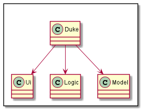
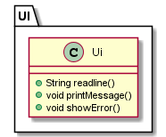
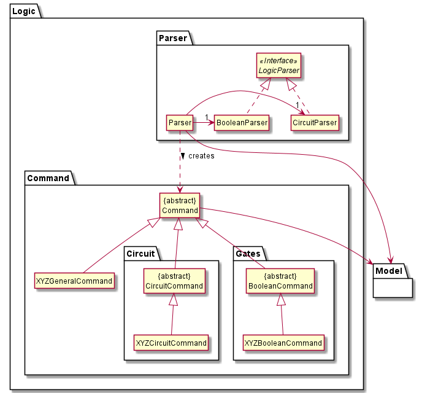
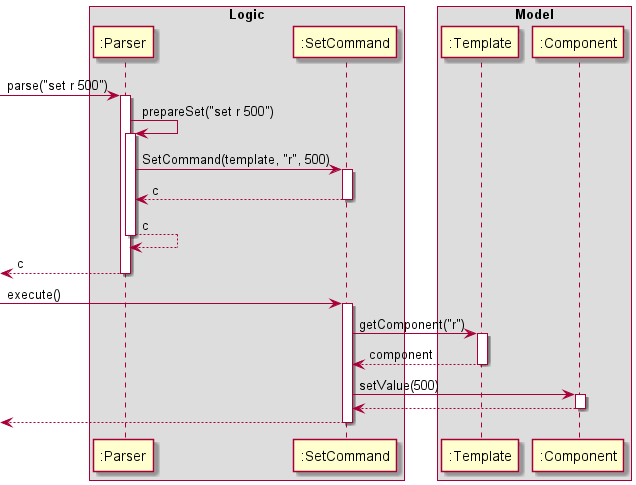
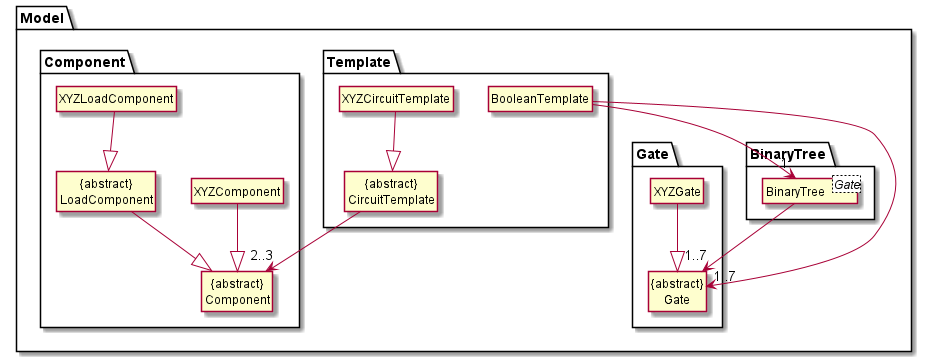
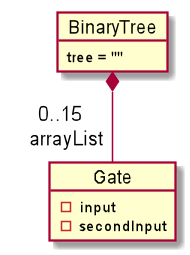
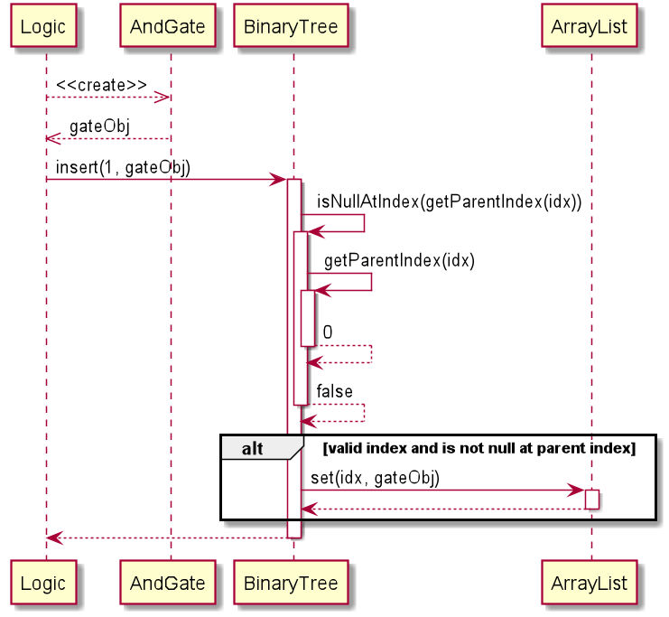
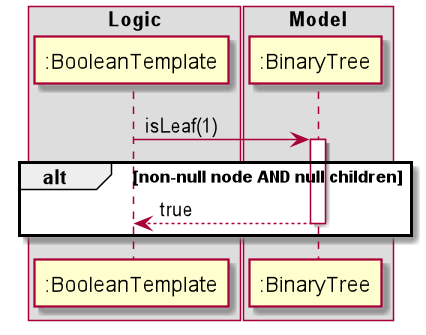
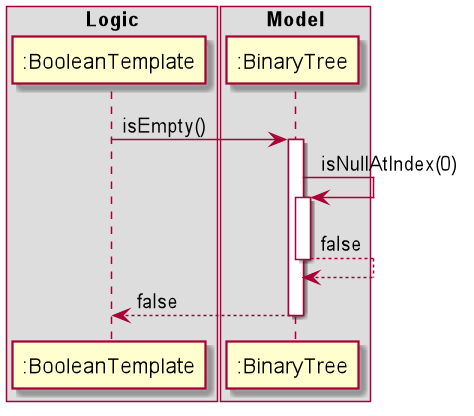

# Developer Guide

## Table of Contents
* [Setting up, getting started](#setting-up)
* [Design & Implementation](#design--implementation)
    * [UI component](#ui-component)
    * [Logic component](#logic-component)
    * [Model component](#model-component)
* [Appendix: Requirements](#appendix-requirements)
    * [Product scope](#product-scope)
    * [User Stories](#user-stories)
    * [Non-Functional Requirements](#non-functional-requirements)
    * [Glossary](#glossary)
* [Appendix: Instructions for manual testing](#appendix-instructions-for-manual-testing)
    * [Initital launch](#initial-launch)
    * [Creating a digital circuit](#creating-a-digital-circuit)
    * [Creating a logic gate](#creating-a-logic-gate)
    * [Calculating values](#calculating-values)
    * [Exiting the program](#exiting-the-program)
    

## Setting up, getting started
Refer to the guide [*Setting up and getting started*](../README.md).

## Design & Implementation



The **Architecture Design** given above explains the high-level design of the App. Given below is a quick overview of each component.

**`Duke`** is the main class of the application, and handles the app launch, initializing the appropriate classes to be used.

The rest of the app consists of four components.

* [**`UI`**](#ui-component): The UI of the App.
* [**`Logic`**](#logic-component): The command executor.
* [**`Model`**](#model-component): Holds the data of the App in memory.

### UI component



The `Ui` component

* Executes user commands using the `Logic` component.
* Listens for changes to `Model` data so that the UI can be updated with the modified data.

### Logic component



1. `Logic` stores a current `Template` object that represents the current circuit configuration.
1. `Logic` uses the `Parser` class to parse the user command.
1. This results in a `Command` object which is executed in `Duke`.
1. The command execution can affect the `Model` (e.g. setting a value).
1. In addition, the `Ui` may also perform certain actions, such as displaying help to the user.

Given below is the Sequence Diagram for interactions within the `Logic` component for the `parse("set r 500")` API call.



### Model component



The `Model`,
* includes `CircuitTemplate` and `BooleanTemplate` that can represent the current `template` in [`Logic`](#logic-component).
* has `Component` and `Gate` within the templates.
* does not depend on any of the other three components.

## Implementation of Boolean Commands

### Binary Tree
The boolean add, set and calculate features are modeled using a generic `BinaryTree<T>` class. The `BooleanTemplate` imports
this class to store and evaluate the logic circuit. 

The elements of the tree are stored in a fixed `ArrayList` (size = 15) indexed in a _heap-like_
manner. That is, a left to right _level-order traversal_ will map to the indexes of the array. The following diagram represents
the indexes each node in the tree corresponds to in the `ArrayList`.
```
                  [0]
                   |     
       [1]                    [2]
                     
  [3]       [4]         [5]         [6]
                      
[7] [8]   [9] [10]   [11] [12]   [13] [14]
```
The operations exposed to the Logic in this Model include: 
* `BinaryTree#isNullAtIndex(int)` - Checks whether the value at specified index in tree is 'null' or not.
* `BinaryTree#getParentIndex(int)` - Returns index of parent node.
* `BinaryTree#insert(int, T)` - Inserts value at position specified in the tree, if valid.
* `BinaryTree#isLeaf(int)` - Returns boolean based on whether node at specified index is a _leaf node_ or not.
* `BinaryTree#isEmpty()` - Checks if the tree has no elements in it.

When an object of the `BinaryTree<T>` class is created, it initialises the ArrayList<T> instance to 15 `null` values. This will be 
further discussed in the section detailing the `insert()` function.

#### Initialising A `BinaryTree<T>` Object
The Logic initialises the `BinaryTree<Gate>` object using the parameterised constructor, thus specifying the Gate class type 
root. The object diagram below depicts the initial state of the Model when a `BinaryTree<Gate>` object is created.



The Logic uses the parameterised constructor of `BinaryTree<T>` to create the object since it requires initialisation of
the root. Such an object is created as follows: `BinaryTree<Gate> obj = new BinaryTree(new OrGate(1,1))`. This sets the root
of the Binary Tree to the object specified.

#### Using `BinaryTree#isNullAtIndex(int)`
`BooleanTemplate` uses this function to render the current configuration of the circuit in a String format. The method
is also extensively used in other internal operations in `BinaryTree<T>` for checking whether a position in the tree has been set or not.

#### Using `BinaryTree#getParentIndex(int, T)`
Similar to `isNullAtIndex(int)`, this method is used in rendering the current configuration of the circuit in String format.

#### Using `BinaryTree#insert(int, T)`
In order to enable the ability to populate the `ArrayList<T>` at any node which has a non-null parent node
the `ArrayList<T> arrayList` attribute is pre-populated with 15 `null` values. The same attribute is modified in the insert()
operation in the list. Since `insert(int, T)` makes use of `ArrayList<T>.set(int, T)`, values in `arrayList` can be overwritten with this function.

The following sequence diagram is a depiction of the events succeeding a call to `insert(1, new AndGate(1,1))`. 


Post calling this function, the second element in the `arrayList` will be the `AndGate(1,1)` object.

#### Using `BinaryTree#isLeaf(int)`
This function is used by the Logic class `BooleanTemplate` to calculate output values in the digital circuit. It 
returns whether the node at the input index is a leaf node or not.

The following sequence diagram is a depiction of the events succeeding a call to `isLeaf(1)`on the current `arrayList`:



#### Using `BinaryTree#isEmpty`
This is used by `BooleanTemplate` to ensure no calculations are being performed on an empty tree.

The following sequence diagram showcases the events succeeding a call to `isEmpty()` on the current object of the `BinaryTree<Gate>` 


 
### Rendering Current Boolean Circuit State
Using a _standard I/O operation_ (Like _Sopln()_) on an object of the `BooleanTemplate` class yields the current configuration
of the system.
Each node of the system is represented by a signal ranging from B to O (OUT being the root). All nodes with null parent nodes are
not shown in the diagram.

## Product scope
### Target user profile
New Computer/Electrical Engineering (CEG/EE) students who are looking for a quick way to check calculations for simple circuit configurations can use this App as an aid.

#### Value proposition

CLIrcuit Assistant solves three problems:

1. Lack of access to simple circuit computation - the App quickly computes the required circuit's values.
1. Doing labs at home because of remote learning - the App provides a quick visualisation tool for the student.
1. Online alternatives require internet access, and some sites are slow to load with many resources needed - the App is an offline desktop application with minimal resources.

### User Stories

|Version| As a ... | I want to ... | So that I can ...|
|--------|----------|---------------|------------------|
|v1.0|new CEG/EE Student |solve electronic/logic circuits through an Interactive Tutorial|get used to using a command line whilst simultaneously learning about circuits and apply the concepts in modules such as CG1111|
|v1.0|new CEG/EE Student|create template circuits using common components such as Resistors, Capacitors, Inductors|visualise and calculate values for common circuit configurations |
|v1.0|new CEG/EE Student | change values assigned to the components| obtain different calculations quickly|
|v1.0|new CEG/EE Student|add components arranged in either series or parallel|obtain my configuration for analysis|
|v1.0|new CEG/EE Student |calculate/verify my calculations of effective resistance, total capacitance, etc.|quickly and accurately do so via CLI, and not 3rd party software that I have to install/load online|
|**v2.0** (latest)|CEG/EE Student|compute a boolean logical expression|familiarise myself with logical computation used in digital circuits|

### Non-Functional Requirements

1. Should work on any *mainstream OS* as long as it has Java 11 or above installed.
2. The average user profile is assumed to be someone who possesses *at least a basic understanding of the fundamental concepts of digital circuits, its components, and boolean logic computation* (concepts covered in CG1111, CS1231 and EE2026).
3. A user with above average typing speed for regular English text (i.e. not code, not system admin commands) should be able to accomplish most of the tasks faster using commands than using the mouse.

## Glossary

* *glossary item* - Definition

## Appendix: Instructions for manual testing
### Initial launch  
1. Download the jar file and copy it into an empty folder
2. Open a new terminal window and navigate to the same directory where your ip.jar is located
3. Enter the command `java -jar duke.jar` into the terminal window to launch the application
4. Enter `help` to go into interactive tutorial mode or `summary` to generate a summary of all the commands

### Creating a digital circuit  
1. Enter `template` followed by the template type, e.g.: `template rc`
There are four templates to choose from: `r`,`rc`,`rl`,`lc`. 
2. Enter `set` followed by the component type to set the component value, e.g.: `set r 500`
The four types of components are: `r`,`c`,`l`,`v`. Note that the value inputted can be an integer or float
3. Enter `add` followed by the configuration, component , and component value to add a component e.g.:`add parallel c 500`

### Creating a logic gate 
Similar to the creation of a digital circuit, we create a `template`, `set` values, and can `add` values.

For the detailed steps, visit: https://ay2021s1-cs2113t-w13-3.github.io/tp/UserGuide.html#logic-gate-commands

### Calculating values
For calculation of values, the `calc` command is used.

Detailed steps on calculation for 

* Digital circuits:  
https://ay2021s1-cs2113t-w13-3.github.io/tp/UserGuide.html#calc-circ

* Logic Gates:  
https://ay2021s1-cs2113t-w13-3.github.io/tp/UserGuide.html#calc-output 

### Exiting the program
Simply enter `bye` to exit the program and bid farewell to ol' Duke.
