# Developer Guide

This **Developer Guide** aims to get developers familiarised with the design and implementation of **CLIrcuit Assistant**. The following table indicates the symbols used to aid the understanding of the guide. This guide also assumes that the reader has basic understanding of *UML Diagrams*. [To access the **User Guide** instead, click here.](UserGuide.md)

| Symbol/Format | Meaning |
|:---------------:|:--------|
|:information_source:|An informational source.|
|:exclamation:|A warning.|
|**Bolded**|A keyword.|
|*Italicised*|Technical word.|
|[Hyperlinked](#)|Leads to the appropriate section.|
|`Code`|Text that appears on the CLI / in code.|

## Table of Contents
* [Setting up, getting started](#setting-up-getting-started)
* [Design Architecture](#design)
    * [UI component](#ui-component)
    * [Logic component](#logic-component)
    * [Model component](#model-component)
* [Implementation of Circuit Commands](#circ-comd)
    * [Creating Template](#temp-circ)
    * [Setting Component](#set-circ)
    * [Adding Component](#add-circ)
    * [Calculating Value](#calc-circ)
* [Implementation of Boolean Commands](#bool-comd)
    * [Binary Tree](#binary-tree)
        * [Initialising A BinaryTree Object](#initialising-a-binarytreet-object)
        * [Using BinaryTree isNullAtIndex(int)](#using-binarytreeisnullatindexint)
        * [Using BinaryTree getParentIndex(int)](#using-binarytreegetparentindexint-t)
        * [Using BinaryTree insert(int, T)](#using-binarytreeinsertint-t)
        * [Using BinaryTree isLeaf(int)](#using-binarytreeisleafint)
        * [Using BinaryTree isEmpty()](#using-binarytreeisempty)
    * [Rendering Current Boolean Circuit State](#rendering-current-Boolean-circuit-state)
* [Appendix: Requirements](#appendix-requirements)
    * [Product scope](#product-scope)
    * [User Stories](#user-stories)
    * [Non-Functional Requirements](#non-functional-requirements)
    * [Glossary](#glossary)
* [Appendix: Instructions for manual testing](#appendix-instructions-for-manual-testing)
    * [Initial launch](#initial-launch)
    * [Creating a digital circuit](#creating-a-digital-circuit)
    * [Creating a logic gate](#creating-a-logic-gate)
    * [Calculating values](#calculating-values)
    * [Exiting the program](#exiting-the-program)
    

## Setting up, getting started
Refer to the guide [*Setting up and getting started*](SettingUp.md).

## Design Architecture <a name="design"></a>


The **Architecture Design** given above explains the high-level design of the App. Given below is a quick overview of each component.

**`Duke`** is the main class of the application, and handles the app launch, initializing the appropriate classes to be used.

The rest of the app consists of three components.

* [**`UI`**](#ui-component): The UI of the App.
* [**`Logic`**](#logic-component): The command executor.
* [**`Model`**](#model-component): Holds the data of the App in memory.

### UI component


The `Ui` component

* Reads user input as lines using `readLine()`.
* Prints every `Command` object that is parsed using `printMessage()`.
* Prints any user input error that might occur using `showError()`.

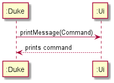

### Logic component


1. `Logic` stores a current `Template` object in [`Model`](#model-component) that represents the current circuit configuration.
1. `Logic` uses the `Parser` class to parse the user command.
1. This results in a `Command` object which is executed in `Duke`.
1. The command execution can affect the `Model` (e.g. setting a value).
1. In addition, the `Ui` may also perform certain actions, such as displaying help to the user.

### Model component


The `Model`,
* includes `CircuitTemplate` and `BooleanTemplate` that can represent the current `template` in [`Logic`](#logic-component).
* has `Component` and `Gate` within the templates.
* does not depend on any of the other three components.

## Implementation of Circuit Commands <a name="circ-comd"></a>
This section provides details on the implementation of the various electronic circuit commands.

There are 4 different types of components of electronic circuits that can be instantiated in the program:
* `Resistor` - A _resistor_ component.
* `Capacitor` - A _capacitor_ component.
* `Inductor` - An _inductor_ component.
* `VoltageSource` - An _Alternating Current_ Voltage Source.

Each component is used within a circuit template, based on the kind of circuit instantiated.

| :information_source: | The `VoltageSource` is instantiated in all Circuit Templates. |
|----------------------|:-------------------------------------|

There are four different circuit templates that can be instantiated in the program:

* `LcTemplate` - Inductor-Capacitor Circuit Template
* `RTemplate` - Resistor Circuit Template
* `RcTemplate` - Resistor-Capacitor Template (extends `RTemplate`)
* `LrTemplate` - Inductor-Resistor Template (extends `RTemplate`)

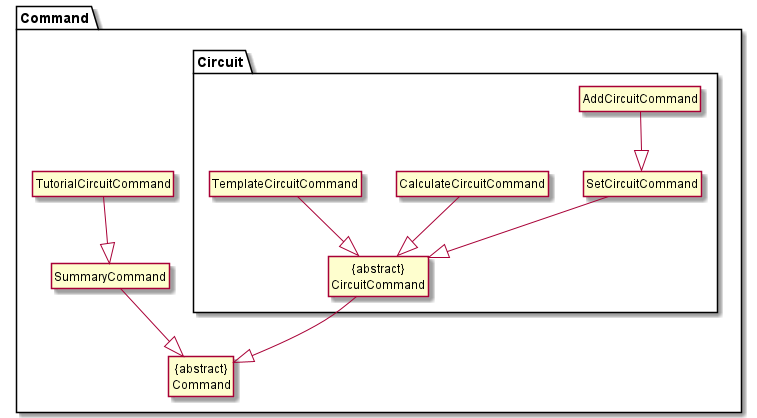

The diagram above demonstrates the relationship between the various `CircuitCommand` objects. The various commands to be parsed are as explained in this section. While the **User Guide** explains the commands used on the CLI, this section goes into detail the classes used to execute the commands. The command classes also make use of the classes in the [**`Model`**](#model-component) shown in the diagram below when executing the commands.

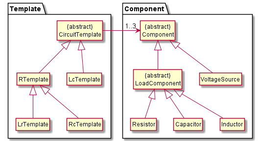

### `TemplateCircuitCommand`  <a name="temp-circ"></a>
Given below is the sequence diagram for interactions within the `logic` and `template` components for the 
`parse(template rl)` API call that implements the `template` command to create templates.

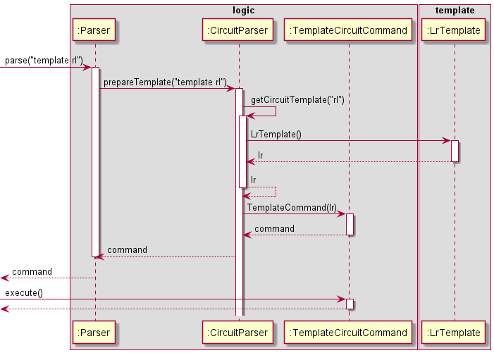

### `SetCircuitCommand` <a name="set-circ"></a>

Given below is the Sequence Diagram for interactions within the `Logic` component for the `parse("set r 500")` API call which implements the `set` command to set values of components.

  

### `AddCircuitCommand` <a name="add-circ"></a>

Given below is the detailed Sequence diagram for interactions within the `logic`, `template` and `component` components 
for the `parse("add parallel c 20")` API call that implements the `add` command to add components.

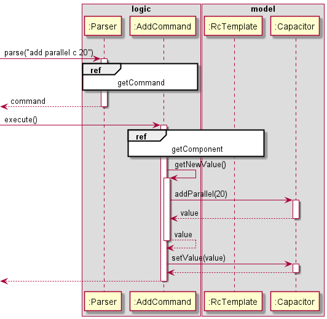  

### `CalculateCircuitCommand` <a name="calc-circ"></a>
The calculate command can be split into two distinct sequence diagrams. Given below is the sequence diagram for the
calculate command that does not show the access of the `component` component and shows the interactions for the
`parse("calc power")` API call that implements this version of the `calculate` command to calculate power.  

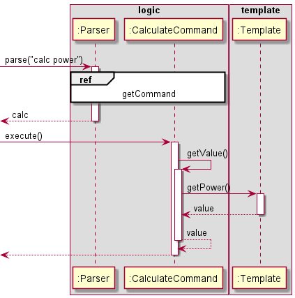  

The second sequence diagram given below shows the detailed interaction that acesses the `component` class through the
`parse("calc reff")` API call that implements this version of the `calculate` command to calculate effective resistance.

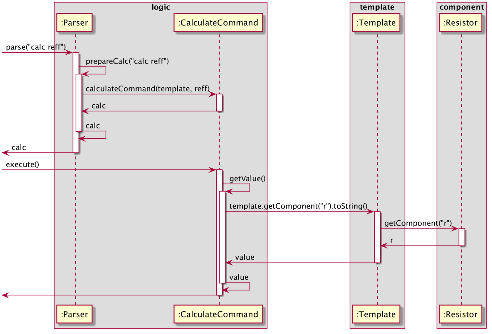  

## Implementation of Boolean Commands <a name="bool-comd"></a>

The second major feature of the application is the implementation of Boolean logic commands, of which various noteworthy implementation details are explained in this section.

### Implementation Considerations
This section describes the methods taken into consideration whilst implementing the Boolean Commands.

#### Rationale Behind Using Binary Heap-Like Data Structure
Selecting the appropriate data structure for emulating a logic circuit is an important aspect to consider whilst
building such a system. The following table depicts the properties of a Binary Heap-Like structure mapped to the 
application's requirements.

| Requirements | Property of Binary Heap |
|:----------:|:-------------:|
| Connects different gates together | A binary-heap, being a type of binary tree, is a _connected graph_. |
| Easily stored | Can be stored in simple contiguous memory like an Array/ArrayList |
| Easy to print | Nodes stored in an array, rather than a graph-like structure |
| Inputs can be easily manipulated | Manipulating augmented values involves a simple _O(1)_ operation. |
| Emulate 2-input logic circuit | Being a binary tree, each node can have atmost 2 children, thus recreating a 2-Input Logic Gate |

Therefore, since the Binary Heap-Like data structure best-fit the requirements for the system, the data structure was selected to
implement a Logic Circuit,

#### Alternatives Considered
The preceding section detailed on the rationale behind choosing the data structure used to emulate the Logic Circuit. 
This section details on the alternative mechanisms considered for the system and why they would not be viable:

* Simple Binary Tree: In essence, a Binary-Heap is a special kind of Binary Tree. However, it is not efficient to store
a Binary Tree in a contiguous memory location such as an Array/ArrayList. Thereby,
    1. Increasing complexity of storage.
    2. Increasing difficulty of manipulating circuit at certain position.

* Graph With Depth First Search: Using a graph means dealing with a more complex structure due to the lack of
restrictions on the number of child-nodes a node can have. Thereby,
    1. Extra considerations/checks for emulating 2-input logic circuit.
    2. Extra checks to test if graph is connected and circuit is complete.

Due to the limitations mentioned above, the Binary Heap-Like data structure was considerd to be the best method of approach.

### Binary Tree
The previous section described the rationale behind using a special Binary Tree-like structure (Heap) for implementing the
Boolean Commands. This section provides details on *how* the logic circuit is modeled using the selected data structure. 

The Boolean `add`, `set` and `calculate` features are modeled using a generic `BinaryTree<T>` class. The `BooleanTemplate` imports this class to store and evaluate the logic circuit. 

The elements of the tree are stored in a fixed `ArrayList` (size = 15) indexed in a _heap-like_ manner. That is, a left to right _level-order traversal_ will map to the indexes of the array. The following diagram represents the indexes each node in the tree corresponds to in the `ArrayList`.
```
                  [0]
                   |     
       [1]                    [2]
                     
  [3]       [4]         [5]         [6]
                      
[7] [8]   [9] [10]   [11] [12]   [13] [14]
```
The operations exposed to the `Logic` in this `Model` include: 
* `BinaryTree#isNullAtIndex(int)` - Checks whether the value at specified index in tree is `null` or not.
* `BinaryTree#getParentIndex(int)` - Returns index of parent node.
* `BinaryTree#insert(int, T)` - Inserts value at position specified in the tree, if valid.
* `BinaryTree#isLeaf(int)` - Returns Boolean based on whether node at specified index is a _leaf node_ or not.
* `BinaryTree#isEmpty()` - Checks if the tree has no elements in it.

When an object of the `BinaryTree<T>` class is created, it initialises the `ArrayList<T>` instance to 15 `null` values. This will be further discussed in the section detailing the `insert()` function.

#### Initialising A `BinaryTree<T>` Object
The `Logic` initialises the `BinaryTree<Gate>` object using the parameterised constructor, thus specifying the `Gate` class type root. The object diagram below depicts the initial state of the `Model` when a `BinaryTree<Gate>` object is created.


The Logic uses the parameterised constructor of `BinaryTree<T>` to create the object since it requires initialisation of
the root. Such an object is created as follows: `BinaryTree<Gate> obj = new BinaryTree(new OrGate(1,1))`. This sets the root of the Binary Tree to the object specified.

#### Using `BinaryTree#isNullAtIndex(int)`
`BooleanTemplate` uses this function to render the current configuration of the circuit in a String format. The method
is also extensively used in other internal operations in `BinaryTree<T>` for checking whether a position in the tree has been set or not.

#### Using `BinaryTree#getParentIndex(int, T)`
Similar to `isNullAtIndex(int)`, this method is used in rendering the current configuration of the circuit in String format.

#### Using `BinaryTree#insert(int, T)`
In order to enable the ability to populate the `ArrayList<T>` at any node which has a non-null parent node
the `ArrayList<T> arrayList` attribute is pre-populated with 15 `null` values. The same attribute is modified in the insert()
operation in the list. Since `insert(int, T)` makes use of `ArrayList<T>.set(int, T)`, values in `arrayList` can be overwritten with this function.

The following sequence diagram is a depiction of the events succeeding a call to `insert(1, new AndGate(1,1))`. 


Post calling this function, the second element in the `arrayList` will be the `AndGate(1,1)` object.

#### Using `BinaryTree#isLeaf(int)`
This function is used by the Logic class `BooleanTemplate` to calculate output values in the digital circuit. It 
returns whether the node at the input index is a leaf node or not.

The following sequence diagram is a depiction of the events succeeding a call to `isLeaf(1)`on the current `arrayList`:


#### Using `BinaryTree#isEmpty`
This is used by `BooleanTemplate` to ensure no calculations are being performed on an empty tree.

The following sequence diagram showcases the events succeeding a call to `isEmpty()` on the current object of the `BinaryTree<Gate>` 


 
### Rendering Current Boolean Circuit State
Using a _standard I/O operation_ (Like _Sopln()_) on an object of the `BooleanTemplate` class yields the current configuration
of the system.
Each node of the system is represented by a signal ranging from B to O (OUT being the root). All nodes with `null` parent nodes are
not shown in the diagram. The following diagram depicts a tree wherein no parent nodes are `null`:
```
              0UT
               |     
      B                  C
                     
  D       E         F         G
                      
H  I     J  K      L  M      N  O
```


## Implementation of Logic Gate Commands

There are six different logic gates that can be instantiated in the program:
- `or, and, nor, nand, xor, xnor`

All gates can be first instantiated using the `Gate` class which has one `int input` and one `int output` as its attributes. 
It has `setInput(int input)` and `getOutput()` as its methods, which are used to set the input of the logic gate and get the output of the gate respectively. 

The six different logic gates take in two different inputs, which necessitates the need for a logic gate class to take in one more input.
This can be achieved by instantiating the `TwoInputGate` class which inherits from the `Gate` class. It has an additional attribute `int secondInput`
to take in the additional input and a method `setSecondInput(int input)` to set the Boolean value of either `0 or 1` to the additional input.

The six different logic gates then individually inherit from the `TwoInputGate` class where the return value of their `getOutput()` function depends
on the logic function of the gate itself. For instance, the `OrGate` which inherits from the `TwoInputGate` class has its `getOutput()` function set to `{return input | secondInput}`, 
which represents the `or` operation.

The `OrGate` can be visualised as such in the following object diagram:

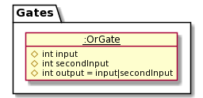
 
The inheritance of the `OrGate` class from `TwoInputGate` class which inherits from the `Gate` class can be seen in the following class diagram:

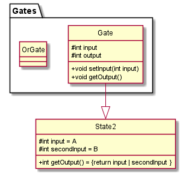


There are four Boolean commands that are used in the implementation of the logic gates: `TemplateBooleanCommand, SetBooleanCommand, AddBooleanCommand`, and `CalcBooleanCommand`.
#### `TemplateBooleanCommand`
The `TemplateBooleanCommand` creates a Boolean template of any one of the six available logic gates. 

The sequence by which the `TemplateBooleanCommand` is instantiated is as follows using the user input `template and` who wants to instantiate an `and` logic template.

1. The `Parser` object takes in a String that specifies the template type: in this case, it is an `and` Boolean template.
2. The `and` Boolean template is then prepared through the `BooleanParser` object.
3. The `and` Boolean template is instantiated using the `TemplateBooleanCommand`.

The aforementioned sequence of events can be represented in the following sequence diagram:

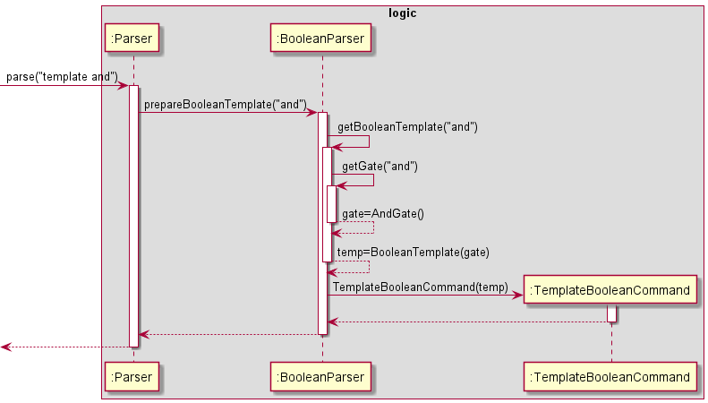


The above sequence of object interactions through the SetBooleanCommand can be represented in the following sequence diagram:

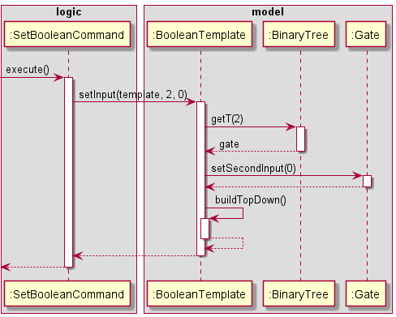

### `AddBooleanCommand`

The `AddBooleanCommand` is used to combine multiple logic gate templates to produce advanced Boolean logic gate configurations.
For instance, an `OrGate` can be combined with an `AndGate` to produce a new logic configuration where its final output will depend on the
Boolean values assigned to the `OrGate` and `AndGate`. This gate configuration can undergo further addition operations by `addBooleanCommand` to 
combine another logic gate, such as `XorGate`. The combination of these three gates after the `addBooleanCommand` operations can be represented by the following object diagram:

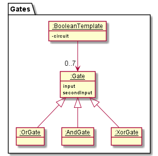

The sequence by which the `AddBooleanCommand` is instantiated to combine the logic gates is as follows:

1. The `AddBooleanCommand` object calls on the `addGate` method in the instantiated `BooleanTemplate`.
2. This will access the index of the `BinaryTree` object in the `BooleanTemplate` to store the newly added gate to the configuration.

The aforementioned sequence of events can be represented in the following sequence diagram:

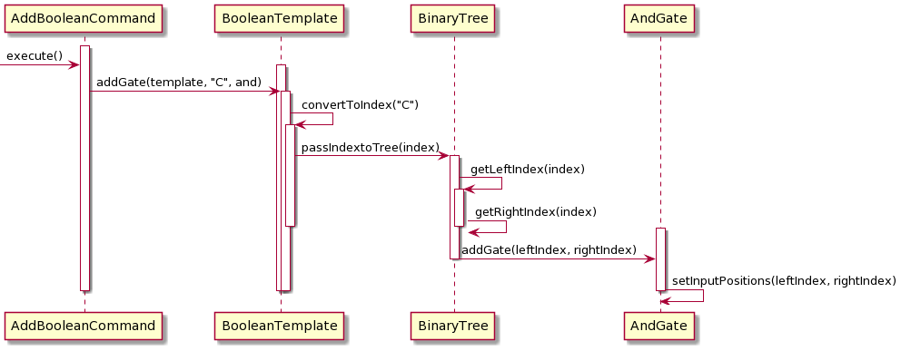

### `CalculateBooleanCommand`

The `CalculateBooleanCommand` is used to calculate the effective output of the configured logic gates stored in the `BinaryTree` is used to , which requires that all inputs be set.

For instance, in a `BinaryTree` object with just two gates - `OrGate` and `AndGate` - all the inputs of the gates have to be assigned before the effective output of both the logic gates (`Input C`) can 
be calculated.

The sequence by which the `CalcBooleanCommand` is instantiated is as follows:

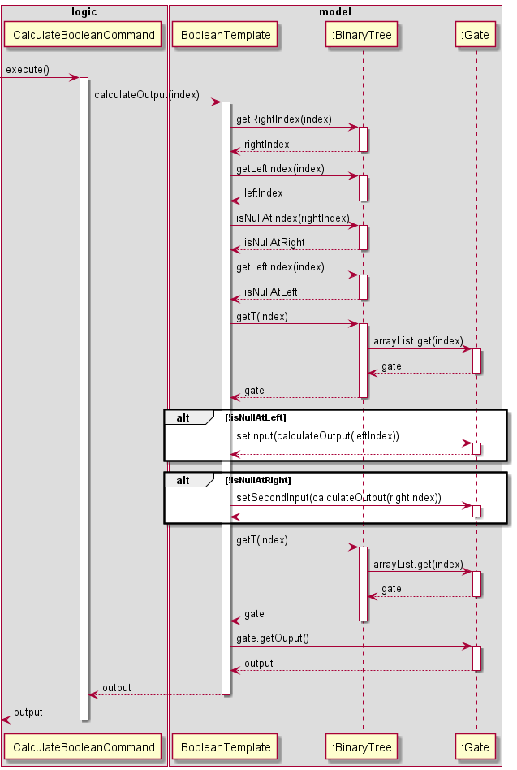

## Appendix: Requirements

This section details the various requirements that the project needs to fulfil.

### Product scope

#### Target user profile
  

New Computer/Electrical Engineering (CEG/EE) students who are looking for a quick way to check calculations for simple circuit configurations can use this App as an aid.

#### Value proposition

**CLIrcuit Assistant** solves three problems:

1. Lack of access to simple circuit computation - the App quickly computes the required circuit's values.
1. Doing labs at home because of remote learning - the App provides a quick visualisation tool for the student.
1. Online alternatives require internet access, and some sites are slow to load with many resources needed - the App is an offline desktop application with minimal resources.

### User Stories

|Version| As a ... | I want to ... | So that I can ...|
|--------|----------|---------------|------------------|
|v1.0|new CEG/EE Student |solve electronic/logic circuits through an Interactive Tutorial|get used to using a command line whilst simultaneously learning about circuits and apply the concepts in modules such as CG1111|
|v1.0|new CEG/EE Student|create template circuits using common components such as Resistors, Capacitors, Inductors|visualise and calculate values for common circuit configurations |
|v1.0|new CEG/EE Student | change values assigned to the components| obtain different calculations quickly|
|v1.0|new CEG/EE Student|add components arranged in either series or parallel|obtain my configuration for analysis|
|v1.0|new CEG/EE Student |calculate/verify my calculations of effective resistance, total capacitance, etc.|quickly and accurately do so via CLI, and not 3rd party software that I have to install/load online|
|v2.0|CEG/EE Student|compute a Boolean logical expression|familiarise myself with logical computation used in digital circuits|
|v2.0|CEG/EE Student|create a template Boolean logic gate to connect more gates to|build a logical circuit|
|v2.0|CEG/EE Student|add logic gates to configure a Boolean logic circuit|create my own configuration of logic gates
|v2.0|CEG/EE Student|set input values to the logic gate configuration|analyse inputs and outputs of a configuration
|v2.0|CEG/EE Student|print the current template I am working on|find out my current configuration and make a decision


### Non-Functional Requirements

1. Should work on any *mainstream OS* as long as it has Java 11 or above installed.
2. The average user profile is assumed to be someone who possesses *at least a basic understanding of the fundamental concepts of digital circuits, its components, and Boolean logic computation* (concepts covered in CG1111, CS1231 and EE2026).
3. A user with above average typing speed for regular English text (i.e. not code, not system admin commands) should be able to accomplish most of the tasks faster using commands than using the mouse.

## Glossary
The terms listed in this glossary are in alphabetical order.

* *Alternating Current* - Alternating current (AC) is an electric current which periodically reverses direction and changes its magnitude continuously with time.
* *AND* - Also known as conjunction, AND is a basic operation in boolean algebra which may be denoted as x AND y. The 
truth value of the operation will result in 1 (TRUE) if both x == 1 and y == 1, and 0 for other combinations of values. 
* *Average Typing Speed* - An average typing speed is [40 words per minute](https://www.livechat.com/typing-speed-test/#/).
* *Binary Tree* - A data structure wherein each node has maximum 2 child nodes, which are called the left and right node.
* *Capacitor* - A passive electronic device with 2 terminals that stores electrical energy in an electric field.
* *CG1111* - Engineering Principles and Practices I, a core module generally taken by Year 1 Computer Engineering students at NUS.
* *Connected Graph* - A graph in which it is possible to get to every node in the graph through a series of edges.
* *CS1231* - Discrete Mathematics, a core module generally taken by Year 1 School of Computing students at NUS.
* *Digital Circuits* - A circuit wherein the signal must be one of 2 discrete logic levels - 1 or 0.
* *EE2026* - Digital Design, a core module generally taken by Year 1 students in Electrical and Computer Engineering at NUS.
* *Graph* - A data structure which consists of a finite set of nodes and a finite set of edges connecting them.
* *Heap* - A tree based data structure where all the nodes are stored in a certain order.
* *Inductor* - A passive electronic device with 2 terminals that stores electrical energy in a magnetic field.
* *Leaf Node* - A node in a binary tree data structure whose left and right children are null.
* *Level Order Traversal* - A method of processing all nodes in a tree data structure by depth (level-by-level).
* *Logic Gate* - A virtual/physical electronic device which performs a boolean function. Usually has 2 inputs and 1 output.
* *Mainstream OS* - For example Microsoft Windows, macOS, Unix, Linux etc.
* *NAND* - An inverse of the AND operation. Outputs are the opposite of what an AND gate would output for a set of input values.
* *Node* - A binary tree is made up of nodes, each which have a left and right reference, as well as hold data.
* *NOR* - An inverse of the OR operation. Outputs the opposite truth value of what an OR gate would output. 
* *O(1)* - An algorithm or a computational operation that is said to take constant time, irrespective of the size of input.
* *OR* - Also known as disjunction, OR is a basic operation in boolean algebra which may be denoted as x OR y. The 
truth value of the operation will result in 1 (TRUE) if either x == 1 or y == 1, and 0 if both x and y are 0. 
* *Parent Node* - A node in a binary tree data structure which has one or more child nodes.
* *Resistor* - A passive electronic device which implements electrical resistance in an electronic circuit.
* *Sopln()* - Abbreviation for java out operation "System.out.println()", from package java.lang.
* *Standard I/O Operation* - Common java I/O streams include System.in, System.out and System.err.
* *XNOR* - An inverse of the XOR operation. Outputs the opposite truth value of what a XOR gate would output.
* *XOR* - Also known as exclusive OR, XOR is a secondary operation in boolean algebra which may be denoted as x XOR y. The 
          truth value of the operation will result in 1 (TRUE) if only one of x == 1 or y == 1, and 0 for other combinations of values.
 

## Appendix: Instructions for manual testing
### Initial launch  
1. Download the jar file and copy it into an empty folder
2. Open a new terminal window and navigate to the same directory where your duke.jar is located
3. Enter the command `java -jar duke.jar` into the terminal window to launch the application
4. Enter `help` to go into interactive tutorial mode or `summary` to generate a summary of all the commands

### Creating a digital circuit  
1. Enter `template` followed by the template type, e.g.: `template rc`
There are four templates to choose from: `r`,`rc`,`rl`,`lc`. 
2. Enter `set` followed by the component type to set the component value, e.g.: `set r 500`
The four types of components are: `r`,`c`,`l`,`v`. Note that the value inputted can be an integer or float
3. Enter `add` followed by the configuration, component , and component value to add a component e.g.:`add parallel c 500`

### Creating a logic gate 
Similar to the creation of a digital circuit, we create a `template`, `set` values, and can `add` values.

For the detailed steps, visit: https://ay2021s1-cs2113t-w13-3.github.io/tp/UserGuide.html#logic-gate-commands

### Calculating values
For calculation of values, the `calc` command is used.

Detailed steps on calculation for 

* Digital circuits:  
https://ay2021s1-cs2113t-w13-3.github.io/tp/UserGuide.html#calc-circ

* Logic Gates:  
https://ay2021s1-cs2113t-w13-3.github.io/tp/UserGuide.html#calc-output 

### Exiting the program
Simply enter `bye` to exit the program and bid farewell to your loyal **CLIrcuit Assistant**.
