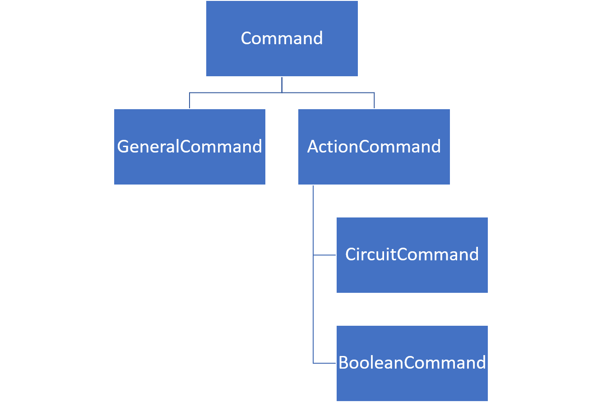
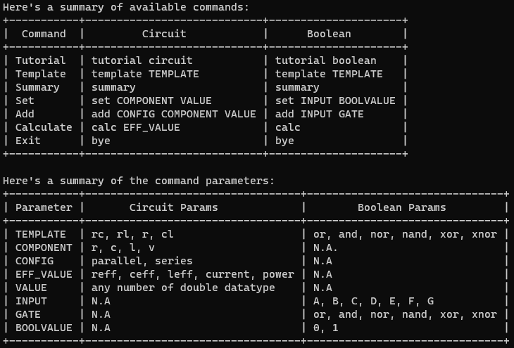
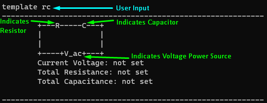
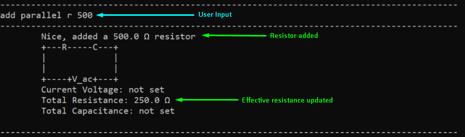
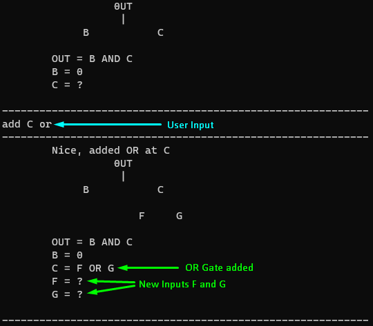

<style>
.alert {
    position:relative;
    padding:.75rem 1.25rem;
    margin-bottom:1rem;
    border:1px solid transparent;
    order-radius:.25rem
}
.alert-primary {
    color:#073984;
    background-image:linear-gradient(180deg, #d6e6ff, #cfe2ff);
    border-color:#bbd6fe
}
.alert-warning {
	color: #856404;
	background-image: linear-gradient(180deg, #fff5d5, #fff3cd);
	border-color: #ffeeba
}
.alert-tip {
    color: #000000;
	background-image: linear-gradient(180deg, #DCECDC, #DCECDC);
	border-color: #DCDCDC
}
</style>
* Table of Contents
{:toc}

## 1. How To Use This Guide

This **User Guide** aims to help you get familiarised with the commands used in the *Command Line Interface* (CLI) application. The following table indicates the symbols used to aid the understanding of the guide. The end of this **User Guide** also gives a [summary of commands](#9-command-summary) used in the application.

| Symbol/Format | Meaning |
|:---------------:|:--------|
|:information_source:|An informational source.|
|:exclamation:|A warning.|
|:bulb:|A tip.|
|**Bolded**|A keyword.|
|*Italicised*|Technical word.|
|[Hyperlinked](#)|Leads to the appropriate section.|
|`Code`|Text that appears on the CLI / in code.|

--------------------------------------------------------------------------------------------------------------------

## 2. Introduction

**CLIrcuit Assistant** is a desktop app to implement and solve simple **circuits** and **logic gate configurations**, optimized for use via the *CLI*. The application is targeted at those who would simply like a resource-light and offline program to aid in analysing circuits. 

At its current implementation, this application has no storage feature. More information on this can be found in the [**Developer Guide**](DeveloperGuide.md#storage-wira).

<div markdown="span" class="alert alert-primary">

:information_source: **Note:**  This application has no storage feature.

</div>

--------------------------------------------------------------------------------------------------------------------

## 3. Quick Start

The following section will explain the steps taken to get **CLIrcuit Assistant** running on your computer.

1. Ensure that you have Java 11 or above installed.
1. Download the latest version of `Duke` from [the releases](https://github.com/AY2021S1-CS2113T-W13-3/tp/releases).
1. Double click the `jar` file to start the application. 
    1. If the above step does not open the app, then open your *terminal* and make sure you are in the folder with the `jar` file. 
    1. Type the following command: 
        ```
        java -jar duke.jar
        ```
1. Once the app starts, type a command in the command line and press enter to execute it.
1. Use the command `tutorial circuit` or `tutorial boolean` to go through an [interactive tutorial](#52-interactive-tutorial) before using the application.
1. Alternatively, you can use the command [`summary`](#51-summary-of-commands-) to get a list of all commands used in the application.
1. Note that a *logging* file `appLog.txt` will be created in the same directory that `duke.jar` is run from. For further information regarding *logging*, you can refer to the [**Developer Guide**](DeveloperGuide.md).

--------------------------------------------------------------------------------------------------------------------

## 4. Command Preface



The diagram above shows the hierarchy of the types of commands in the application. [If you are looking for the summary of commands used within the CLI app, it can be found at the end of this guide](#9-command-summary). In this **User Guide**, you can find the following sections listed below:

* [General Commands](#5-general-commands)
* [Circuit Action Commands](#6-circuit-action-commands)
* [Boolean Action Commands](#7-boolean-action-commands)

General commands are commands which are not specific to features available using the action commands.

Action commands are split into **two categories** - they may use the same *syntax* for some commands, but the application will continuously track the current `template` that is being worked on and automatically use the correct command to execute. Thus, if there is no current `template`, then the other commands used will not be available to run.

<div markdown="span" class="alert alert-primary">

:information_source: **Note:** The `template` command is essential.

</div>

The commands involved with both categories are:

* `template`
* `set`
* `add`
* `calc`

The format of commands below keep to the following.

<div markdown="span" class="alert alert-primary">

:information_source: **Note:**  Words in `UPPER_CASE` are parameters.

</div>

<div markdown="span" class="alert alert-primary">

:information_source: **Note:**  Given a command parsed to require *n* arguments, any argument after the *n*th argument will be ignored.

</div>


--------------------------------------------------------------------------------------------------------------------

## 5. General Commands

This section details the generic commands that can be used. These commands assist you in finding out **generic information** regarding the application.

### 5.1 Summary of Commands <a name="summary"></a>

This command prints a summary of all commands in the application as shown in [Command Summary](#9-command-summary).

| Command Format | 
|:-:|
|`summary`|

The image below shows the expected summary table shown with the command `summary`.



### 5.2 Interactive Tutorial

To aid the user, this command starts the interactive tutorial for either the [Circuit Action Commands](#6-circuit-action-commands) or [Boolean Action Commands](#7-boolean-action-commands) based on the parameter specified. 

| Command Format | 
|:-:|
|`tutorial TYPE`|

* `TYPE` can be either `circuit` or `boolean`.

Once you have entered the interactive tutorial, you are to follow the instructions provided to them as follows:

The interactive tutorial for circuit commands in `tutorial circuit` is as follows:
```
You have entered
  _______    _             _       _   __  __           _      _
 |__   __|  | |           (_)     | | |  \/  |         | |    | |
    | |_   _| |_ ___  _ __ _  __ _| | | \  / | ___   __| | ___| |
    | | | | | __/ _ \| '__| |/ _` | | | |\/| |/ _ \ / _` |/ _ \ |
    | | |_| | || (_) | |  | | (_| | | | |  | | (_) | (_| |  __/_|
    |_|\__,_|\__\___/|_|  |_|\__,_|_| |_|  |_|\___/ \__,_|\___(_)

Type 'exit' if you want to leave this mode and go back to the application.

Let's get started! First we will choose a template to work with. In the app you can choose from rc, rl, lc, and r templates.
However, for this tutorial, we will use a Resistor-Capacitor template.
To select the Resistor-Capacitor circuit template, enter 'template rc'
```
The interactive tutorial for boolean commands in `tutorial boolean` is as follows:


```
You have entered
  _______    _             _       _   __  __           _      _
 |__   __|  | |           (_)     | | |  \/  |         | |    | |
    | |_   _| |_ ___  _ __ _  __ _| | | \  / | ___   __| | ___| |
    | | | | | __/ _ \| '__| |/ _` | | | |\/| |/ _ \ / _` |/ _ \ |
    | | |_| | || (_) | |  | | (_| | | | |  | | (_) | (_| |  __/_|
    |_|\__,_|\__\___/|_|  |_|\__,_|_| |_|  |_|\___/ \__,_|\___(_)

Type 'exit' if you want to leave this mode and go back to the application.
Lets get started! First chose a template you want to work with. You can chose from and, or, nand, nor, xor and xnor gate templates.
eg. To select the and gate template, enter 'template and'
```
When you have entered the tutorial, you will be required to type in the commands in the terminal
for each step of the tutorial as per the instructions given to them. 

You will be required to do this until you have
reached the end of the tutorial where you will be asked to exit as follows:

```
Hooray! You're set to use the circuit builder of 
  _____ _      _____                _ _                      _     _              _   
 / ____| |    |_   _|              (_) |       /\           (_)   | |            | |
| |    | |      | |  _ __ ___ _   _ _| |_     /  \   ___ ___ _ ___| |_ __ _ _ __ | |_
| |    | |      | | | '__/ __| | | | | __|   / /\ \ / __/ __| / __| __/ _` | '_ \| __|
| |____| |____ _| |_| | | (__| |_| | | |_   / ____ \\__ \__ \ \__ \ || (_| | | | | |_
 \_____|______|_____|_|  \___|\__,_|_|\__| /_/    \_\___/___/_|___/\__\__,_|_| |_|\__|

Enjoy! :)
type 'exit' to exit this mode.
```
When you have typed in a command that is inconsistent with what is required as per the tutorial's
instruction for that particular step, an invalid command message will be returned until you type 
in the correct command in the terminal line as shown below. 

You may also choose to exit the program at that point of 
time instead.

```
Bad Command! Please follow the instructions carefully.
To exit Tutorial Mode, simply type 'exit' and press Enter.
```

--------------------------------------------------------------------------------------------------------------------

## 6. Circuit Action Commands 

This section details how the commands are used with a **circuit template**. You can use this section to build simple template circuits which may have a *voltage source* with *load components* such as *resistors*, *capacitors*, or *inductors*. 

It may be important to note that the circuit diagrams shown in the expected outputs are simplified circuits, even when [adding components](#63-adding-a-component). For example, adding a resistor in parallel to a template that contains a resistor will change the effective resistance in the circuit, but it will not dynamically update the visualised diagram to show a second resistor.

<div markdown="span" class="alert alert-primary">

:information_source: **Note:**  With the limited time and GUI constraints, there is no dynamic visualisation update for the circuits.

</div>

### 6.1 Creating a circuit template <a name="template-circ"></a>

This command creates a circuit template. This command must be used to be able to use the `set`, `add`, `calc` commands since those commands must be done on an existing `template`.

| Command Format | 
|:-:|
|`template TEMPLATE`|

* The `TEMPLATE` can be chosen from the following 4:
    * `r` only consists of the resistor.
    * `rc` consists of the resistor and capacitor.
    * `rl` consists of the resistor and inductor.
    * `lc` consists of the inductor and capacitor.

The diagram below shows an example when using the `template rc` command.



### 6.2 Setting a component value <a name='set-comp'></a>

This command sets the value of a component. The component must be part of the current circuit template. Units correspond to the component involved - *resistors* in *ohms*, *capacitors* in *microfarads*, and *inductors* in *microhenries*. The values would need to be set to perform calculations or analysis such as in the [`calc` command](#64-calculating-effective-value-).

<div markdown="span" class="alert alert-warning">

:exclamation: **Warning:** You cannot set a component not present in the current working template.

</div>

| Command Format | 
|:-:|
|`set COMPONENT VALUE`|

* The `COMPONENT` can be chosen from the following 4, but only if they are part of the template:
    * `r` represents a resistor
    * `c` represents a capacitor
    * `l` represents an inductor
    * `v` represents a voltage source
* The `VALUE` can be an integer of a float, of which the units depends on the component set.

Example of usage:

`set r 500`

Expected Outcome:
```
The resistor was set to 500.0 Ω
	+---R-----C---+
	|             |
	|             |
	+----+V_ac+---+
Current Voltage: 0.0 V
Total Resistance: 500.0 Ω
Total Capacitance: 0.0 µF
```

### 6.3 Adding a component <a name="add-comp"></a>

This command adds a component, in a specific configuration - either *in parallel* or *in series* - to the current circuit template. This allows you to quickly obtain calculations to your chosen configurations. Only *load components* can be added - you cannot add a *voltage source*. You should only add a component after it has already been set.

<div markdown="span" class="alert alert-tip">

:bulb: **Tip:**  You can add components as long as there is already a value set using the `set` command.

</div>

<div markdown="span" class="alert alert-warning">

:exclamation: **Warning:** You cannot add a component not present in the current working template.

</div>

<div markdown="span" class="alert alert-warning">

:exclamation: **Warning:** You cannot add a new *voltage source* `v` to any template.

</div>

| Command Format | 
|:-:|
|`add CONFIG COMPONENT VALUE`|

* The `CONFIG` can be chosen from the 2 - `series` and `parallel`.
* The `COMPONENT` and `VALUE` are as explained above under [Set component value](#62-setting-a-component-value-), except that `COMPONENT` cannot be the voltage source `v`.

The image below shows an example of using the command `add parallel r 500` on a template.



### 6.4 Calculating effective value <a name="calc-circ"></a>

This command calculates the various effective values based on the `template` configuration. If calculating `reff`, `ceff`, or `leff`, the component must be part of the current circuit template. You can obtain the various values detailed below quickly after setting the necessary components.

<div markdown="span" class="alert alert-warning">

:exclamation: **Warning:** You cannot calculate the value of a component not present in the current working template.

</div>

<div markdown="span" class="alert alert-primary">

:information_source: **Note:**  If a component is not yet set, its effective value, as well as the *current* and *power* flowing through the power supply, will default to 0.

</div>

| Command Format | 
|:-:|
|`calc EFF_VALUE`|

* The `EFF_VALUE` can be chosen from the following 5:
    * `reff` is the effective resistance
    * `ceff` is the effective capacitance
    * `leff` is the effective inductance
    * `current` is the current flowing through the power supply
    * `power` is the power supplied by the power supply

Example of usage:

`calc reff`

Expected Outcome:

```
The effective resistance calculated is 250.0 Ω
```

--------------------------------------------------------------------------------------------------------------------

## 7. Boolean Action Commands

This section details how the commands are used with a **boolean template**. You can use this section to build simple logic circuits which may be made up of various *gates* such as `AND`, `OR`, and `XOR` *gates*.

### 7.1 Creating a boolean template <a name='template-logic'></a>

This command creates a boolean template. Similar to the [circuit template](#6-circuit-action-commands), this command must be used to be able to use the `set`, `add`, `calc` commands since those commands must be done on an existing `template`.

<div markdown="span" class="alert alert-primary">

:information_source: **Note:**  In all expected outcomes, `?` denotes an input that is not yet set.

</div>

| Command Format | 
|:-:|
|`template GATE`|

* The `GATE` can be chosen from the following:
    * `and`, `or`, `xor`, `nand`, `nor`, `xnor`

Example of usage:

`template and`

Expected outcome:

```
      OUT
       |
   B       C

OUT = B AND C
B = ?
C = ?
```
Here, `OUT` represents the output of the boolean template. The letters `B` and `C` can correspond to `INPUT` which is used in the following section. `?` represents an `INPUT` which is not yet set.

### 7.2 Setting an input value <a name='set-input'></a>

This command sets the value of an input. The inputs will then be used in the `calc` command to give the output of the boolean template. The input must not have already been set as a `Gate` and must be part of the diagram.

<div markdown="span" class="alert alert-warning">

:exclamation: **Warning:** The `INPUT` must exist in the diagram, and must not have already been set as a `Gate`.

</div>

| Command Format | 
|:-:|
|`set INPUT VALUE`|

* The `INPUT` can be chosen only from the current `template`.
* The `VALUE` can be any *integer*, but any valid non-zero *integer* will be treated as `1`, while 0 is treated as `0`. Valid *integers* are defined as the *Java* `int` type.

Example of usage:

`set B 0`

Expected Outcome:
```
      OUT
       |
   B       C

OUT = B AND C
B = 0
C = ?
```

### 7.3 Adding a Gate <a name="add-gate"></a>

The application has the ability to combine multiple `Gate` objects to generate more complicated boolean *logic gate* configurations. This command allows you to set an input to a boolean logic `Gate`. You can also change an existing gate if needed. However, the depth of the deepest logic `Gate` from the *root* logic `Gate` (at the top) cannot exceed 2.

<div markdown="span" class="alert alert-tip">

:bulb: **Tip:**  You can use this command to change an existing `Gate`.

</div>

<div markdown="span" class="alert alert-warning">

:exclamation: **Warning:** The `Gate` depth cannot exceed 2.

</div>

<div markdown="span" class="alert alert-primary">

:information_source: **Note:**  The current implementation only allows the `Gate` objects to be 2 levels deep, counting from 0 at the top. This means you may see inputs up to the 3rd level, up to the letter `O`.

</div>

| Command Format | 
|:-:|
|`add INPUT GATE`|

* The `INPUT` is as explained above in [Set](#72-setting-an-input-value-).
* The `GATE` is as explained above in [Template](#71-creating-a-boolean-template-).

The image below shows an example of using the command `set C or` on the template shown.



### 7.4 Calculating output <a name="calc-output"></a>

This command calculates the output of the configured logic *gates*, and requires that all inputs of the circuit are set. The output is represented by `OUT` in the printed `template`.

<div markdown="span" class="alert alert-warning">

:exclamation: **Warning:** The output cannot be calculated if any input is not set yet.

</div>

| Command Format | 
|:-:|
|`calc`|

Example of usage:

`calc`

Expected Outcome:

```
      OUT
       |
   B       C
         F   G

OUT = B AND C
B = 0
C = F OR G
F = 1
G = 0

The output of the above configuration is 0.
```

--------------------------------------------------------------------------------------------------------------------

## 8. FAQ

This section details the **frequently asked questions (FAQ)** regarding the use of the application.

**Q**: How do I know the difference between the components?

**A**: Pay attention in CG1111 Engineering Principles & Practice (EPP).

**Q**: How do I know what each logic gate does?

**A**: Pay attention in EE2026 Digital Design.

**Q**: Why is the interactive tutorial so restrictive?

**A**: This is by design. Once you get the hang of the application, you can exit the tutorial to use the commands proper.

**Q**: Why does using the `add` command for the circuit template give me a "Component not yet set" error?

**A**: You have to first set the component involved using the [`set` command](#62-setting-a-component-value).

--------------------------------------------------------------------------------------------------------------------

## 9. Command Summary

This section summarises the commands used in the application.

Action | Format, Examples
--------|------------------
**Tutorial** | `tutorial TYPE` <br> e.g., `tutorial circuit`
**Summary** | `summary`
**Template Circuit/Logic Gate** | `template TEMPLATE/GATE` <br> e.g., `template rc` <br> e.g., `template and`
**Set Circuit/Logic Gate** | `set COMPONENT/INPUT VALUE` <br> e.g., `set r 500` <br> e.g., `set B 0`
**Add Circuit** | `add CONFIG COMPONENT VALUE`<br> e.g., `add parallel c 500`
**Add Logic Gate** | `add INPUT GATE`<br> e.g., `add C or`
**Calculate Circuit/Logic Gate** | `calc EFF_VALUE/[]` <br> e.g., `calc ceff` <br> e.g., `calc`

--------------------------------------------------------------------------------------------------------------------

## 10. Glossary

This section explains certain technical terms used in the guide which may require more detail.

Term | Explanation
-|-
*capacitors* | A component which stores electrical energy in an electrical field
*Command Line Interface (CLI)* | Text-based user interface which the application uses to interact with the user
*current* | Flow of electric charge in a circuit
*inductors* | A component which stores energy in a magnetic field when electric *current* flows throw it
*integer* | A whole number 
*load components* | A component which consumes electric power
*logging* | Keeping a record of information about events which take place, specific to the application
*logic gate* | Physical electronic device implementing a Boolean function
*power* | Rate at which electrical energy is transferred by a circuit
*resistors* | A component which provides electrical resistance
*root* | A point of reference for which other points can be traced back to
*syntax* | Rules in which a command must be run
*voltage source* | A device which can maintain a fixed voltage