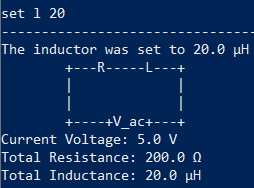

**CLIrcuit Assistant** is a desktop app to implement and solve simple circuits, optimized for use via the Command Line Interface (CLI).

Useful links:
* If you are interested in using **CLIrcuit Assistant**, head over to the [**User Guide**](UserGuide.md).
* If you are interested about developing **CLIrcuit Assistant**, the [**Developer Guide**](DeveloperGuide.md) is a good place to start.
* [About Us](AboutUs.md) lets you know more about the team behind this project.
