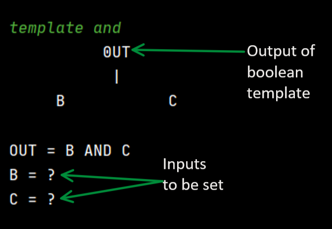

* Table of Contents
{:toc}

## Overview

* **Deliverables and Deadlines**: Responsible for keeping track of submission deadlines for the project team and planning of timeline for the preparation of the respective deliverables.
* **Git Expert**: Helps other team members with matters related to Git and Github, including running various Git commands on the command line. 
* **Writing of `Command`, `Exceptions`, and `tests` of the code**: Assists in the writing of the code that deals with different commands, as well as the execution of said commands based on user input. Also responsible for writing exception handlers and JUnit tests to improve defensiveness and code testability of the program.  

## Summary of Contributions

### Code Contributed

[This is the RepoSense report of the code contributed.](https://nus-cs2113-ay2021s1.github.io/tp-dashboard/#breakdown=true&search=dorianfong98&sort=groupTitle&sortWithin=title&since=2020-09-27&timeframe=commit&mergegroup=&groupSelect=groupByRepos&checkedFileTypes=docs~functional-code~test-code~other)

### Enhancements Implemented

#### Circuit Components

* **PR**: [#21](https://github.com/AY2021S1-CS2113T-W13-3/tp/pull/21), [#27](https://github.com/AY2021S1-CS2113T-W13-3/tp/pull/27), [#31](https://github.com/AY2021S1-CS2113T-W13-3/tp/pull/31)

Wrote the code for the following circuit components:

* `VoltageSource`
* `RTemplate` (The base class for circuit templates with Resistors)

Added the classes to the component package and template package respectively.

Introduced the getImpedance() feature for RTemplates, refactored the code for `LrTemplate`(Resistor+Inductor) circuit template to inherit from RTemplate, updated the `Template` classes accordingly. JavaDoc was also added to the methods afterwards.

#### Unit Testing & Assertions

* **PR**: [#44](https://github.com/AY2021S1-CS2113T-W13-3/tp/pull/44), [#102](https://github.com/AY2021S1-CS2113T-W13-3/tp/pull/102)

Updated the abovementioned classes. Added JUnit Tests `BinaryTreeTest` and `ExitCommandTest`.

#### Circuit Commands Enhancements

* **PR**: [#93](https://github.com/AY2021S1-CS2113T-W13-3/tp/pull/93)

Added/Updated classes in the `commands.circuit`, `model.template`, `ui` packages, as well as updated the `ParserTest` to handle new commands.

#### JavaDoc Comprehensiveness

* **PR**: [#167](https://github.com/AY2021S1-CS2113T-W13-3/tp/pull/167)

Added/Updated documentation comments for most, if not all, of the files in the program (especially classes) in accordance with the Java Coding Standard guidelines and conventions for the final release. 

### Extract: Product Website, User Guide, Developer Guide

* **PRs**: 
[#63](https://github.com/AY2021S1-CS2113T-W13-3/tp/pull/63), 
[#74](https://github.com/AY2021S1-CS2113T-W13-3/tp/pull/74), 
[#76](https://github.com/AY2021S1-CS2113T-W13-3/tp/pull/76), 
[#77](https://github.com/AY2021S1-CS2113T-W13-3/tp/pull/77), 
[#78](https://github.com/AY2021S1-CS2113T-W13-3/tp/pull/78),
[#170](https://github.com/AY2021S1-CS2113T-W13-3/tp/pull/170)

[#63](https://github.com/AY2021S1-CS2113T-W13-3/tp/pull/63): 
Drafted Non-Functional Requirements in Developer Guide, Getting Started, as well as the instructions for manual testing of CLIrcuit Assistant.

[#74](https://github.com/AY2021S1-CS2113T-W13-3/tp/pull/74), [#77](https://github.com/AY2021S1-CS2113T-W13-3/tp/pull/77): 
Squashed bugs found in Table of Contents for Developer Guide.

[#76](https://github.com/AY2021S1-CS2113T-W13-3/tp/pull/76), [#78](https://github.com/AY2021S1-CS2113T-W13-3/tp/pull/78): 
Made minor but long overdue modifications to naming, ASCII art, etc.

### Extract: Contributions to User Guide
* **PRs**: [#170](https://github.com/AY2021S1-CS2113T-W13-3/tp/pull/170)

[#170](https://github.com/AY2021S1-CS2113T-W13-3/tp/pull/170):
Addressing feedback from PE dry run, constructed and added an annotated diagram to the User Guide in an attempt to improve readability for the average user by assuming little to no experience or technical knowledge in either the field of Digital/Boolean Circuits or just in running CLI applications.
>The image below shows an example when using the `template and` command.

>
