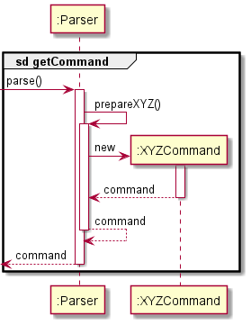

* Table of Contents
{:toc}

## Overview

* **Team lead**: Responsible for overall project coordination.
* **Documentation**: Responsible for the quality of various project documents.
* **PlantUML expert**: Helps other team members with matters related to PlantUML.
* **In charge of `Parser`,`Ui` of the code**: In charge of the code that deals with parsing and UI.

## Summary of Contributions

### Code Contributed

[This is the RepoSense report of the code contributed.](https://nus-cs2113-ay2021s1.github.io/tp-dashboard/#breakdown=true&search=hughjazzman&sort=groupTitle&sortWithin=title&since=2020-09-27&timeframe=commit&mergegroup=&groupSelect=groupByRepos&checkedFileTypes=docs~functional-code~test-code~other)

### Enhancements Implemented

#### Code, Packages Setup

* **PR**: [#8](https://github.com/AY2021S1-CS2113T-W13-3/tp/pull/8), [#24](https://github.com/AY2021S1-CS2113T-W13-3/tp/pull/24), [#25](https://github.com/AY2021S1-CS2113T-W13-3/tp/pull/25)

Set up the skeleton code used in the project, including the following classes:

* `Parser`
* `Ui`
* `Command`
* `Component`

Introduced the Add Component feature, refactored the `Component` classes, added the classes within the `command` package, updated the `Parser` class, and update some `Template` classes, as well as `Ui` and `Duke`. JavaDoc was also added to `Command.execute()` methods.

#### Unit Testing & Assertions

* **PR**: [#36](https://github.com/AY2021S1-CS2113T-W13-3/tp/pull/36), [#39](https://github.com/AY2021S1-CS2113T-W13-3/tp/pull/39), [#106](https://github.com/AY2021S1-CS2113T-W13-3/tp/pull/106), [#49](https://github.com/AY2021S1-CS2113T-W13-3/tp/pull/49)

Updated various classes mentioned [above](#add-components-and-command-classes-). Added classes `AddCommand` and `SetCommand` and JUnit Tests `ParserTest`.

Refactored code according to updated Design Architecture - reduced coupling between `Ui` and `Command` to follow Architecture in updated [**Developer Guide**](../DeveloperGuide.md). Added assertions to make the code more defensive.

#### Boolean Commands Setup

* **PR**: [#53](https://github.com/AY2021S1-CS2113T-W13-3/tp/pull/53), [#71](https://github.com/AY2021S1-CS2113T-W13-3/tp/pull/71), [#82](https://github.com/AY2021S1-CS2113T-W13-3/tp/pull/82), [#83](https://github.com/AY2021S1-CS2113T-W13-3/tp/pull/83)

Added/Updated classes in the `commands.gates`, `model.component`, `model.binarytree` packages, as well as updated the `BooleanParser` to handle new commands.

Added functionalities for `BooleanCommand` and its subclasses.

#### PED Bugs

* **PR**: [#156](https://github.com/AY2021S1-CS2113T-W13-3/tp/pull/156)

Squashed bugs found in the PE Dry Run. These included high severity bugs such as [#148](https://github.com/AY2021S1-CS2113T-W13-3/tp/pull/148), [#151](https://github.com/AY2021S1-CS2113T-W13-3/tp/pull/151), with some other medium and low severity bugs as well.

### User Guide

* **PRs**: [#9](https://github.com/AY2021S1-CS2113T-W13-3/tp/pull/9), [#45](https://github.com/AY2021S1-CS2113T-W13-3/tp/pull/45), [#59](https://github.com/AY2021S1-CS2113T-W13-3/tp/pull/59), [#61](https://github.com/AY2021S1-CS2113T-W13-3/tp/pull/61), [#91](https://github.com/AY2021S1-CS2113T-W13-3/tp/pull/91), [#109](https://github.com/AY2021S1-CS2113T-W13-3/tp/pull/109), [#158](https://github.com/AY2021S1-CS2113T-W13-3/tp/pull/158), [#159](https://github.com/AY2021S1-CS2113T-W13-3/tp/pull/159), [#163](https://github.com/AY2021S1-CS2113T-W13-3/tp/pull/163)

Set up the first draft of User Guide for the project, starting with all commands discussed in the initial group meeting in [#9](https://github.com/AY2021S1-CS2113T-W13-3/tp/pull/9), [#45](https://github.com/AY2021S1-CS2113T-W13-3/tp/pull/45). Updated User Guide with v2.0 commands in [#59](https://github.com/AY2021S1-CS2113T-W13-3/tp/pull/59), and updated their expected outcomes in [#61](https://github.com/AY2021S1-CS2113T-W13-3/tp/pull/61). Numerous PED Bugs were also squashed in [#158](https://github.com/AY2021S1-CS2113T-W13-3/tp/pull/158), with many of them being high severity, as can be seen in [#154](https://github.com/AY2021S1-CS2113T-W13-3/tp/issues/154).

### Developer Guide

* **PR**: [#45](https://github.com/AY2021S1-CS2113T-W13-3/tp/pull/45), [#50](https://github.com/AY2021S1-CS2113T-W13-3/tp/pull/50), [#59](https://github.com/AY2021S1-CS2113T-W13-3/tp/pull/59), [#61](https://github.com/AY2021S1-CS2113T-W13-3/tp/pull/61), [#91](https://github.com/AY2021S1-CS2113T-W13-3/tp/pull/91), [#109](https://github.com/AY2021S1-CS2113T-W13-3/tp/pull/109), [#113](https://github.com/AY2021S1-CS2113T-W13-3/tp/pull/113), [#119](https://github.com/AY2021S1-CS2113T-W13-3/tp/pull/119), [#121](https://github.com/AY2021S1-CS2113T-W13-3/tp/pull/121)

Created structure of Developer Guide, starting with Architecture in [#45](https://github.com/AY2021S1-CS2113T-W13-3/tp/pull/45). Created UML Diagrams with the help of PlantUML, including Class Diagrams found in the Architecture and Sequence Diagram for `SetCircuitCommand`. As the IC for documentation, improvements were also made to diagrams made by other group members, such as the Class Diagrams found under the Implementation of Boolean Commands. User Stories discussed by the group were also added into its own section.

### Review/Mentoring

Almost all PRs were reviewed, with the notable ones listed below:

* [#19](https://github.com/AY2021S1-CS2113T-W13-3/tp/pull/19), [#21](https://github.com/AY2021S1-CS2113T-W13-3/tp/pull/21), [#27](https://github.com/AY2021S1-CS2113T-W13-3/tp/pull/27), [#34](https://github.com/AY2021S1-CS2113T-W13-3/tp/pull/32), [#35](https://github.com/AY2021S1-CS2113T-W13-3/tp/pull/35): Spotted minor fixes
* [#23](https://github.com/AY2021S1-CS2113T-W13-3/tp/pull/23), [#26](https://github.com/AY2021S1-CS2113T-W13-3/tp/pull/26), [#38](https://github.com/AY2021S1-CS2113T-W13-3/tp/pull/38), [#41](https://github.com/AY2021S1-CS2113T-W13-3/tp/pull/41), [#43](https://github.com/AY2021S1-CS2113T-W13-3/tp/pull/43), [#51](https://github.com/AY2021S1-CS2113T-W13-3/tp/pull/51), [#56](https://github.com/AY2021S1-CS2113T-W13-3/tp/pull/56), [#62](https://github.com/AY2021S1-CS2113T-W13-3/tp/pull/62), [#63](https://github.com/AY2021S1-CS2113T-W13-3/tp/pull/63), [#90](https://github.com/AY2021S1-CS2113T-W13-3/tp/pull/90), [#93](https://github.com/AY2021S1-CS2113T-W13-3/tp/pull/93), [#100](https://github.com/AY2021S1-CS2113T-W13-3/tp/pull/100), [#116](https://github.com/AY2021S1-CS2113T-W13-3/tp/pull/161), [#160](https://github.com/AY2021S1-CS2113T-W13-3/tp/pull/160), [#161](https://github.com/AY2021S1-CS2113T-W13-3/tp/pull/161): Gave minor suggestions accepted by teammate
* [#42](https://github.com/AY2021S1-CS2113T-W13-3/tp/pull/42), [#54](https://github.com/AY2021S1-CS2113T-W13-3/tp/pull/54), [#92](https://github.com/AY2021S1-CS2113T-W13-3/tp/pull/92): Gave a number of suggestions accepted by teammate
* [#75](https://github.com/AY2021S1-CS2113T-W13-3/tp/pull/75): Gave many suggestions accepted by teammate, taking the role of **PlantUML expert**

### Beyond Project Team

#### Forum Posts

* [Special Characters in CLI](https://github.com/nus-cs2113-AY2021S1/forum/issues/22)
* [Using Tables and Emojis on Github pages](https://github.com/nus-cs2113-AY2021S1/forum/issues/61)
* [Question on Assertion and Exception](https://github.com/nus-cs2113-AY2021S1/forum/issues/87)

#### Forum Comments

* [Use of `this` keyword](https://github.com/nus-cs2113-AY2021S1/forum/issues/27#issuecomment-683380238)
* [Wildcard Imports](https://github.com/nus-cs2113-AY2021S1/forum/issues/36#issuecomment-687758900)
* [Static vs Instance Classes](https://github.com/nus-cs2113-AY2021S1/forum/issues/88#issuecomment-708482154)

### Extract: User Guide - Adding a Gate

To aid the user in understanding the User Guide, informational boxes such as below are put in the appropriate commands. The example is from [7.3 Adding a Gate](UserGuide.md#73-adding-a-gate-).

> The application has the ability to combine multiple `Gate` objects to generate more complicated boolean *logic gate* configurations. This command allows you to set an input to a boolean logic `Gate`. You can also change an existing gate if needed. However, the depth of the deepest logic `Gate` from the *root* logic `Gate` (at the top) cannot exceed 2.

:bulb: **Tip:**  You can use this command to change an existing `Gate`.

:exclamation: **Warning:** The `Gate` depth cannot exceed 2.

:information_source: **Note:**  The current implementation only allows the `Gate` objects to be 2 levels deep, counting from 0 at the top. This means you may see inputs up to the 3rd level, up to the letter `O`.

| Command Format | 
|:-:|
|`add INPUT GATE`|

### Extract: Developer Guide - Logic Class and Sequence Diagrams

To better showcase the relationships between the various classes used in the project, the following UML diagrams were used to explain the Architecture of the application. A reference frame was also used so that the diagrams explained in the later section could be more concise. The following example is from [Logic Component](#DeveloperGuide.md#logic-component).

<small><i>Figure 4</i></small>

> 1. `Logic` stores a current `Template` object in [`Model`](#model-component) that represents the current circuit configuration.
> 1. `Logic` uses the `Parser` class to parse the user command.
> 1. This results in a `Command` object which is executed in `Duke`.
> 1. The command execution can affect the `Model` (e.g. setting a value).

> In general, the creation of `Command` objects via `Parser` can be explained by the following sequence diagram, which acts as a reference frame for `getCommand`:

> <small><i>Figure 5</i></small>

> If the command does not use the reference frame, they would have their own sequence diagram to showcase the difference.