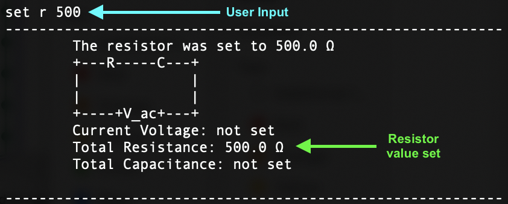

## Project: CLIrcuit Assistant 
## Overview

* **Testing**: Responsible for overall testing.
* **Scheduling and Tracking**: Responsible for tracking the project.
* **Template code in-charge**: In-charge of handling issues related to code of the templates.

## Summary of Contributions

### Code Contributed

[This is the RepoSense report of the code contributed.](https://nus-cs2113-ay2021s1.github.io/tp-dashboard/#breakdown=true&search=&sort=groupTitle&sortWithin=title&since=2020-09-27&timeframe=commit&mergegroup=&groupSelect=groupByRepos&checkedFileTypes=docs~functional-code~test-code~other&tabOpen=true&tabType=authorship&tabAuthor=PraveenElango&tabRepo=AY2021S1-CS2113T-W13-3%2Ftp%5Bmaster%5D&authorshipIsMergeGroup=false&authorshipFileTypes=docs~functional-code~test-code~other)

### Project Contributions

#### Code Contributions

The list of code contributions with links to the PRs includes the following:

* `Resistor` Object Class [#19](https://github.com/AY2021S1-CS2113T-W13-3/tp/pull/19)
    * The `Resistor` object stores the value of the resistance of the component
    
* `RcTemplate` Object Class [#26](https://github.com/AY2021S1-CS2113T-W13-3/tp/pull/26)
    * The `RcTemplate` object represents the Resistor-Capacitor template
    
* `getImpedance()` function for `RcTemplate` Class [#32](https://github.com/AY2021S1-CS2113T-W13-3/tp/pull/32)
    * The `getImpedance()` function is used to return the impedance of the circuit
    
* `or`, `not`, and `xor` Logic Gate Classes [#56](https://github.com/AY2021S1-CS2113T-W13-3/tp/pull/56)
    * The `or`, `not`, and `xor` logic gates are three out of the six logic gates used in this assistant, with the other three being `and`, `nor`, and `nand`.
    
* Updated `Ui` by including prompts and a Command-Template table [#100](https://github.com/AY2021S1-CS2113T-W13-3/tp/pull/100)
    * The prompt was included for user to start using the assistant
    
* Updated `Ui` for Boolean Tutorial [#161](https://github.com/AY2021S1-CS2113T-W13-3/tp/pull/161)
    * Minor changes made to user interface design

#### Unit Testing & Assertions

The list of contributions for testing and assertions include the following:

* Added unit testing to Template tests including `RTemplate`, `RcTemplate`, `LrTemplate`, `LcTemplate` [#42](https://github.com/AY2021S1-CS2113T-W13-3/tp/pull/42)
* Added assertions to all circuit templates including `RTemplate`, `RcTemplate`, `LrTemplate`, `LcTemplate` [#52](https://github.com/AY2021S1-CS2113T-W13-3/tp/pull/52)
* Included JUnit tests for remaining commands including `SetCommandTest` [#58](https://github.com/AY2021S1-CS2113T-W13-3/tp/pull/58)

### User Guide

The list of contributions for the User Guide include the following:

* Included explanation for why interactive tutorial enters infinite loop by design [#162](https://github.com/AY2021S1-CS2113T-W13-3/tp/pull/162)
* Included labeled diagrams for both setting of circuit and boolean commands [#169](https://github.com/AY2021S1-CS2113T-W13-3/tp/pull/169)
* Made grammatical changes to entire User Guide document [#179](https://github.com/AY2021S1-CS2113T-W13-3/tp/pull/179)

### Developer Guide

The list of contributions for the Developer Guide include the following:

* Documented entire section for boolean commands by including UML diagrams (class, object, and sequence diagrams) and corresponding explanations for
`TemplateBooleanCommand`,`AddBooleanCommand`, `SetBooleanCommand`, `CalcBooleanCommand` [#75](https://github.com/AY2021S1-CS2113T-W13-3/tp/pull/75)
* Made grammatical changes to entire Developer Guide document [#179](https://github.com/AY2021S1-CS2113T-W13-3/tp/pull/179)

### Extract: User Guide

The image below shows an example of using the command `set r 500` on the template shown.

### Extract: Developer Guide

### `CalculateBooleanCommand` 

The `CalculateBooleanCommand` is used to calculate the effective output of the configured logic gates stored in the `BinaryTree`, which requires that all inputs be set.

For instance, in a `BinaryTree` object with just two gates - `OrGate` and `AndGate` - all the inputs of the gates have to be assigned before the effective output of both the logic gates (`Input C`) can 
be calculated.

The sequence by which the `CalcBooleanCommand` is instantiated is as follows:

